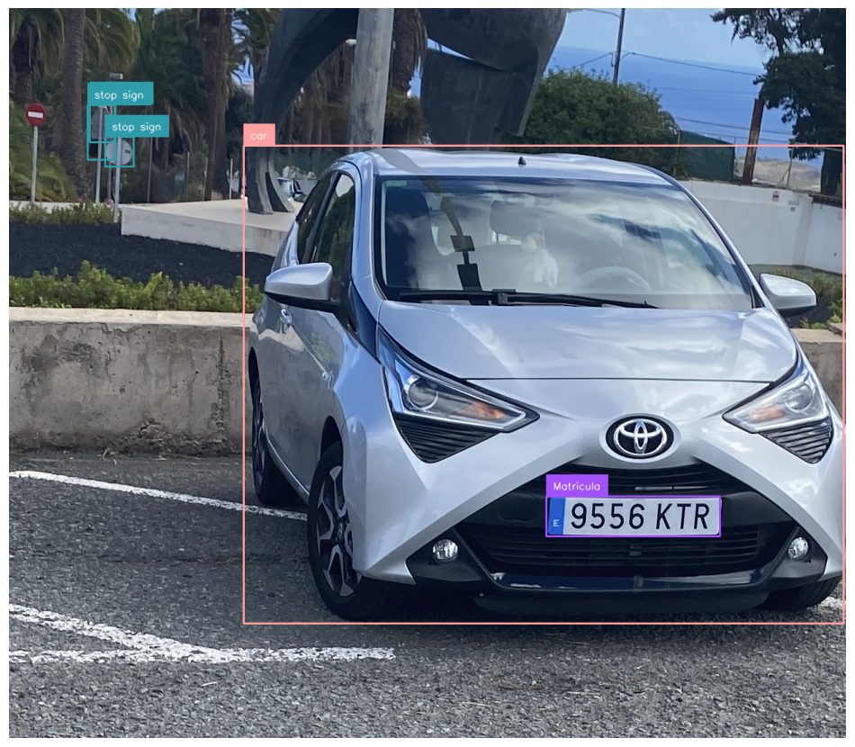

Nombre Integrantes grupo 12:
Ramón Valls Martin
Noah Ramos González

Descripción de la Tarea de la práctica 4:

Para la realización de la práctica hemos hecho uso de las librerías necesarias: cv2 para manejo de imágenes, YOLO de ultralytics para detección de objetos, easyocr para reconocer texto en imágenes, y supervision para la anotación de resultados en la imagen. 

Lo que hacemos en esta práctica es realizar un análisis automatizado del video del campus para detectar y seguir personas, coches y matrículas utilizando modelos YOLO y EasyOCR. Configurado para aprovechar CUDA cuando está disponible, el sistema captura cuadros de video en tiempo real, identifica personas y coches en el marco. Además, para cada coche detectado, aplica una segunda detección de matrícula y extrae el texto mediante OCR, guardando la información en un archivo CSV junto con las coordenadas, confianza y texto de la matrícula reconocida. Finalmente, se genera un video anotado con todas las detecciones y un resumen de los objetos detectados, que facilita la visualización y revisión de los resultados.

1. Modelo yolo11n.pt en fotos:

Implementamos un sistema de detección de objetos para identificar coches y matrículas en una imagen utilizando modelos YOLO y la biblioteca EasyOCR para reconocer texto en las matrículas detectadas. Se cargan dos modelos YOLO, uno general para detectar personas y coches y otro específico para detectar matrículas en los coches detectados, y la imagen de prueba se lee y se carga en memoria. 
El modelo general detecta objetos en la imagen y se filtran las detecciones para quedarse solo con los coches, luego se anotan los coches detectados con etiquetas visuales y se almacena una imagen recortada de cada detección de coche. Sobre la imagen recortada del coche detectado, se aplica el modelo específico para identificar la región de la matrícula, transformando los límites de la caja de detección de la matrícula de nuevo a las coordenadas de la imagen original para hacer anotaciones y etiquetado directo en esta última. 

Luego convertimos la imagen de la matrícula a escala de grises para mejorar la precisión de OCR y EasyOCR que  detecta y extrae el texto en la región de la matrícula, mostrando "Matrícula" si se identifica correctamente o un mensaje de error en caso contrario. Finalmente, se muestra la imagen con las anotaciones en consola para verificar los resultados visuales, incluyendo las etiquetas de identificación de coche y matrícula detectada.

2. Modelo entrenado yoloMatric.pt para detección de matriculas en vídeo:

Seguidamente implementamos un sistema para detectar y reconocer matrículas en un video usando modelos YOLO y EasyOCR. Primero, se importan las bibliotecas necesarias. Se cargan dos modelos YOLO: yolo11n.pt para detectar personas y coches y yoloMatric.pt, más específico para detectar matrículas, además de inicializar el lector de OCR. A continuación, se configura la captura del video de entrada y el video de salida. 

Primero cogimos un modelo dataset de matrículas, lo entrenamos con 40 epochs y size 640 y con las validaciones que se nos generaron en la carpeta runs, usamos el modelo best.pt que llamamos como final.pt.
Usamos estos comandos:
yolo train model=yolov8n.yaml data=P4/Dataset/dataset.yaml epochs=40 imgsz=640
yolo val model=runs/detect/train/weights/best.pt data=P4/Dataset/dataset.yaml

Se crea un archivo CSV para registrar todas las detecciones, donde se almacena la información requerida por la práctica como el número de cuadro, tipo de objeto, confianza y coordenadas de la detección. Se inicializan contadores para el total de personas, coches y matrículas. En un bucle que procesa cada cuadro del video, se detectan personas y coches, se registran las detecciones en el CSV, y se filtran solo los coches para realizar la detección de matrículas. Se recorta el área de cada coche detectado y se aplica el modelo de matrículas. 

Por último, si se detecta una matrícula, se aplica OCR para leer el texto y se almacena en el CSV junto con las coordenadas de la matrícula. Se dibujan las cajas delimitadoras y se añade el texto en la imagen original, que se guarda en el video de salida. Al final, se imprime un resumen del total de detecciones y se liberan los recursos utilizados.

