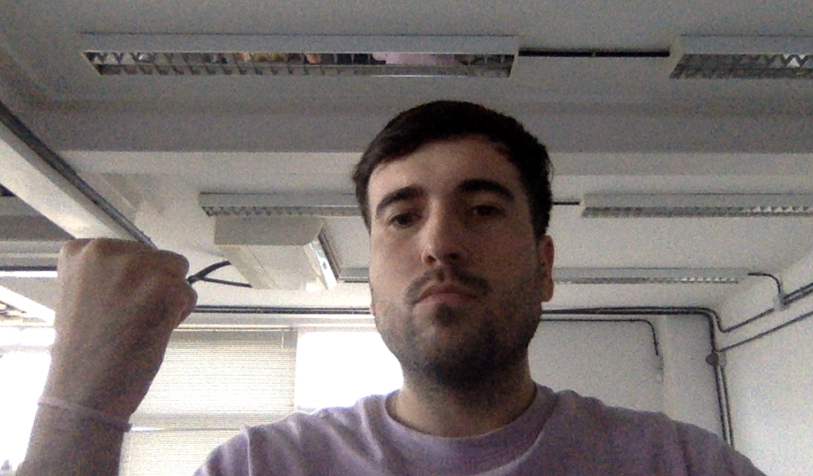
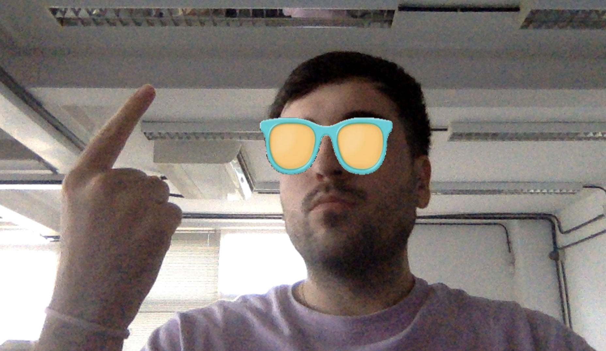
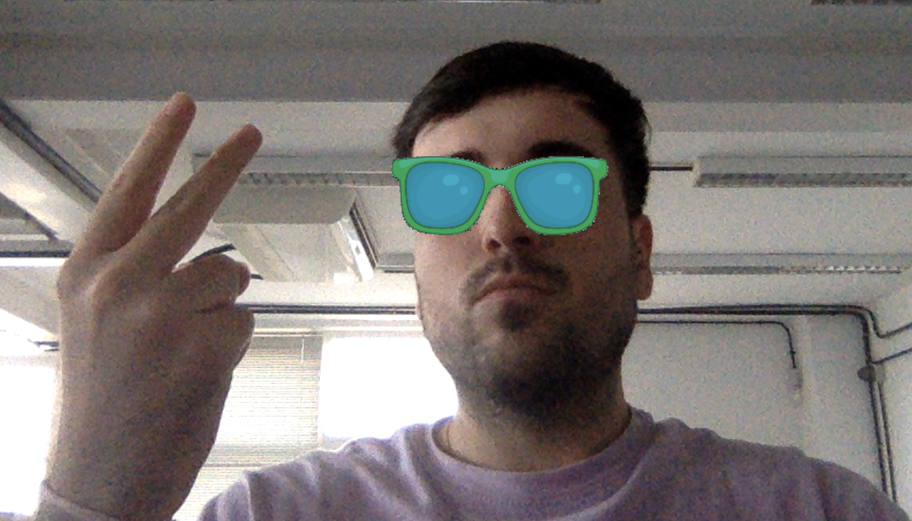

## Práctica 5. Detección y caracterización de caras

Grupo 12: 
Ramón Valls Martin.
Noah Ramos González.

Este proyecto implementa una aplicación que detecta nuestras caras en tiempo real usando la biblioteca MediaPipe de Google y la superposición de gafas en el rostro del usuario en función de gestos que hagamos con las manos. La práctica está diseñada para reconocer cuándo se levantan uno o dos dedos y, dependiendo del gesto, superpone una imagen de gafas diferente sobre el rostro.

1. Detector de manos:

Primero, el código define una clase detectorManos, que configura MediaPipe para la detección de manos, como vimos en  prácticas anteriores. Esta clase permite, mediante los parámetros proporcionados en el constructor, ajustar la complejidad del modelo, la cantidad máxima de manos detectadas, y los niveles de confianza tanto para la detección como para el seguimiento de las manos. Dentro de la clase se implementan funciones para detectar manos y determinar la posición de sus puntos clave en el fotograma. La función encontrarManos convierte el fotograma a escala de grises y luego procesa la imagen usando MediaPipe para detectar las manos en la escena. También, se dibujan los puntos y las conexiones de las manos, si así se especifica. La función encontrarPosicion localiza cada uno de los puntos de las manos en el espacio de la imagen y devuelve sus coordenadas y el área delimitadora. Esta información es clave para identificar y posicionar las gafas en la cara.

Una función esencial en la clase es dedosArriba, que verifica si los dedos están levantados o no. Usando los puntos clave de los dedos, se evalúa si están doblados o extendidos, guardando los resultados en una lista binaria que representa el estado de cada dedo. Esto permite contar los dedos levantados con la función numeroDedos. En función de este recuento, el programa elige la imagen de gafas que se va a superponer en el fotograma.

2. Detección de caras:

Para la detección de caras y puntos clave en el rostro como los ojos, el código utiliza MediaPipe Face Mesh y Face Detection. Face Detection permite obtener una caja delimitadora del rostro, que sirve de referencia para calcular las dimensiones y posición donde se superpondrán las gafas. Face Mesh, por otro lado, proporciona puntos clave faciales más detallados, como los de los ojos izquierdo y derecho, necesarios para posicionar correctamente las gafas.

La superposición de las gafas en el rostro sigue una serie de pasos: 
Se carga la imagen de las gafas y se convierte a escala de grises para crear una máscara binaria, lo cual permite extraer únicamente el contorno de las gafas. Luego, se determina la posición media entre ambos ojos para centrar la imagen de las gafas. La máscara permite filtrar la región de la cara que corresponde a las gafas, y mediante operaciones de bitwise se combinan los píxeles de la imagen de las gafas con el fotograma original. Finalmente, el resultado se inserta en el fotograma en tiempo real.

El programa emplea OpenCV para la captura de video y la visualización de los resultados. La ejecución se realiza en un bucle que procesa cada fotograma, mostrando el video con las gafas sobre el rostro cuando el usuario levanta uno o dos dedos.

  